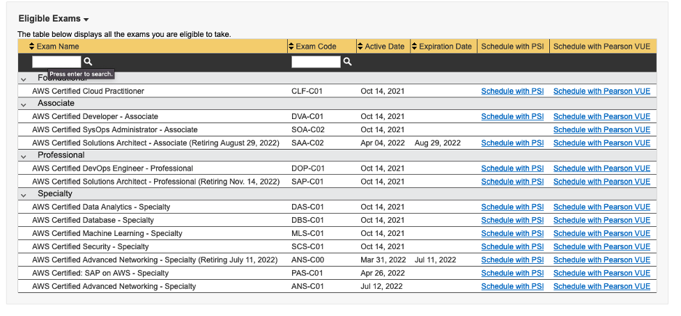
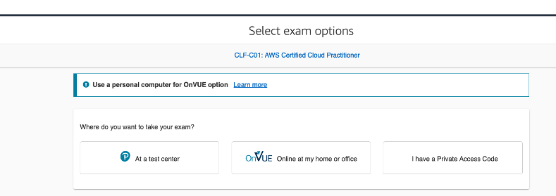
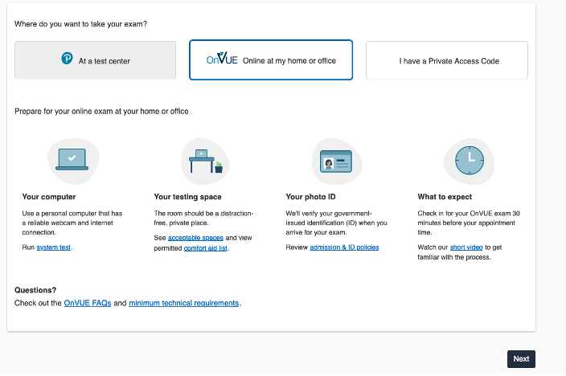
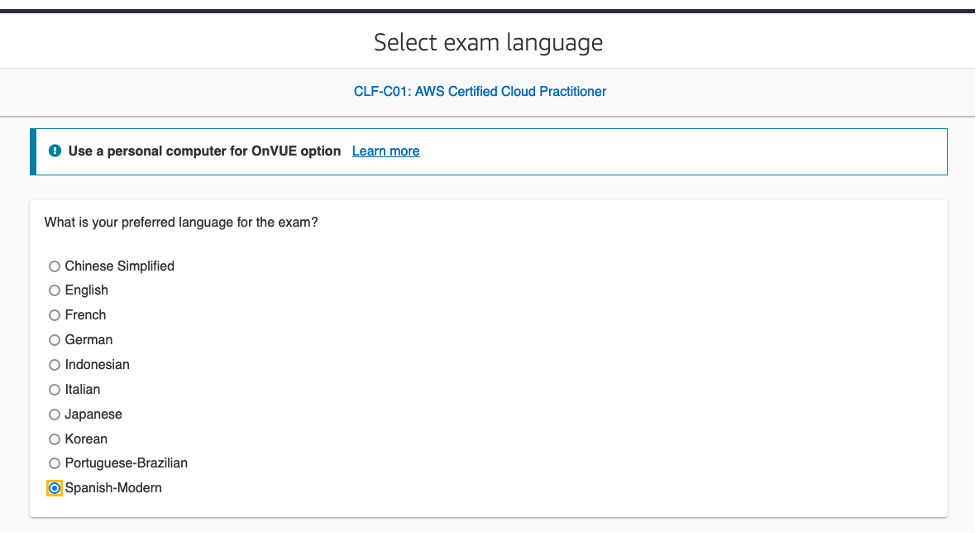
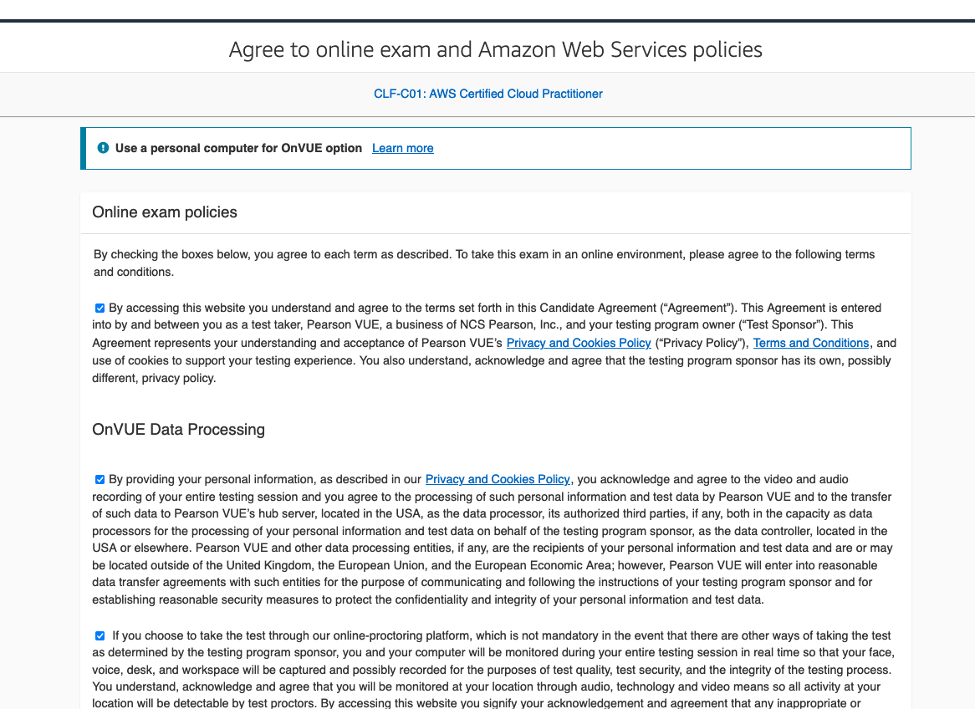
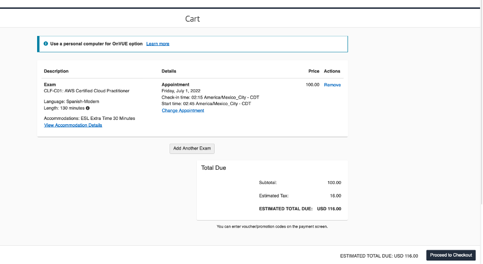

+++ 
title = "Agendar examen" 
chapter = true 
weight = 20 
+++

**Cómo agendar un examen de certificación de Amazon Web Services**

1. Ir a {}AWS Certification{}

1. Seleccionar en el menú superior **Certification** y luego dar *click* en **SIGN IN** (Si no tiene una cuenta debes crearla asegurar del mantener el mismo Candidate ID).

    

1. Ir al examen que desea presentar en el ejemplo se mostrará como seleccionar AWS Certified Cloud Practitioner. Se encuentran 2 opciones de proveedores o centros de testing para presentar el examen, puede ser presencial en un centro de evaluación o virtual (examen supervisado en línea).

    - Presencial: debe seleccionar un centro de testing más conveniente.

    - Virtual: debe contar con una computadora, una conexión a internet estable, una camara web y seguir las recomendaciones del proveedor del examen acerca de las condiciones del espacio físco donde presentarás el examen.

    El ejemplo de como agendar un examen que se muestra es seleccionado como proveedor a **PearsonVue** (pero puedes seleccionar **PSI**). Recomendamos verificar ambos centros para ver temas de costos, comisiones, fechas disponibles, ubicaciones, etc.

    

    Una vez seleccionado **PearsonVue** se va a redireccionar a su sitio web para agendar el examen.

1. Seleccionar la modalidad del examen, virtual o presencial.

    

    

1. Seleccionar el idioma.

    

1. Aceptar las condiciones. Marcar todas las casillas y seleccionar **NEXT** al final de las condiciones.

    

1. Seleccionar el idioma del PROCTOR.

    

1. Confirmar la zona horaria donde te encuentres.

    

1. Seleccionar el día para presentar el examen y a continuación se habilitarán en el panel inferior los horarios disponibles para ese día.

    

1. Una vez seleccionada la hora y dar **Next** se presentará el resumen del costo del examen para generar el pago. En caso de contar con voucher en el siguiente paso se habilitará la opción para agregar el código para su canje.

    {}En caso de que cuente con un voucher promocional, debe asegurarse de haber seleccionado el proveedor de examen correspondiente a dicho voucher.
    {}

    

