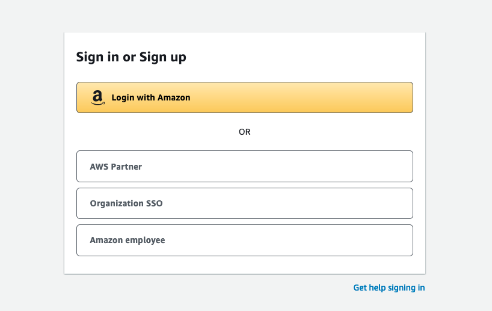

+++ 
title = "Agendar examen" 
chapter = true 
weight = 20 
+++

**Cómo agendar un examen de certificación de Amazon Web Services**

1. Ir a {}AWS Certification{}

1. Seleccione la opción **Sign In** que encontrará en la esquina superior derecha.

1. Si trabaja para un Partner de AWS, seleccione la opción **AWS Partner** y luego ingrese sus credenciales.

    

1. En la barra superior de la página de **AWS Training** seleccione **Certification**

1. Seleccione **GO TO YOUR ACCOUNT**

    

1. En la esquina superior derecha encontrará la opción para cambiar el idioma si así lo desea.

    

1. Seleccione **Inscribirse a un examen**

1. Encontrará una lista de los examenes de certificación disponibles, entre ellos el examen **AWS Certified Cloud Practitioner**. Seleccione la opción **Programar con Pearson VUE** a la derecha del nombre del examen de certificación.

1. Le aparecerá un recuadro con información importante sobre el examen. Favor de revisar la información y luego cerrar el cuadro de texto.

1. El proveedor Pearson Vue ofrece la opción de presentar el examen de certificación de forma presencial o virtual. Seleccione la opción deseada.

1. Deberá seleccionar el idioma que desea presentar su examen, **AWS Certified Cloud Practitioner** está disponible para ser presentado en múltiples idiomas, entre ellos **Español** e **Inglés**.

1. Lea con atención los *Términos y Condiciones* y seleccione **Aceptar** al final de la página.

1. En caso de haber seleccionado la opción de presentar el examen de forma presencial, deberá buscar y seleccionar el centro de evaluación mas conveniento de acuerdo a su ubicación. Siga las instrucciones en pantalla.

1. En caso de haber seleccionado la opción de presentar el examen de forma virtual, deberá también aceptar las *Políticas de exámenes en línea*

1. De haber seleccionado la opción de presentar el examen de forma virtual, deberá indicar también el idioma del *supervisor* (o *proctor*) que lo acompañará durante su examen de forma remota.

    

1. Seccione la fecha y hora mas conveniente dentro de las opciones que el centro de evaluación le proporcione.

1. Seleccione **Continuar con el pago**, ingrese un método de pago. En caso de contar con un *Voucher* de descuento, favor de ingresarle en el recuadro **Código de promoción/cupón**.

1. Concluya la compra y en breve le llegará una confirmación por correo electrónico del proveedor con información relevante sobre su examen.

**¡MUCHO EXITO!**

Consulte además: <a href="https://aws.amazon.com/blogs/training-and-certification/5-tips-for-a-successful-online-proctored-aws-certification-exam/" target="_blank">5 recomendaciones para tener un examen virtual exitoso [en inglés]</a>
