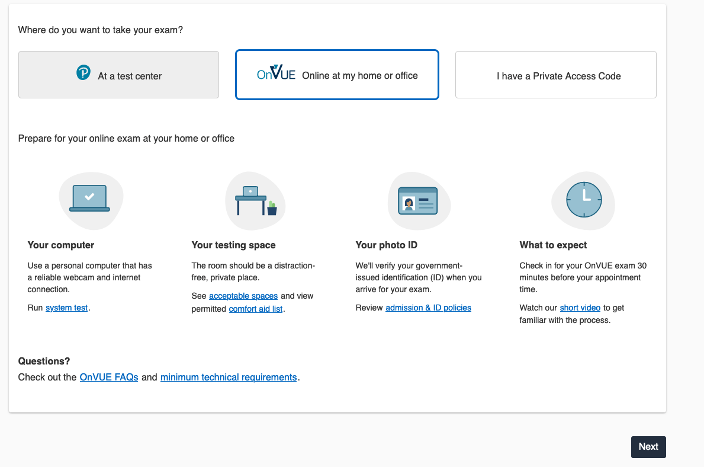
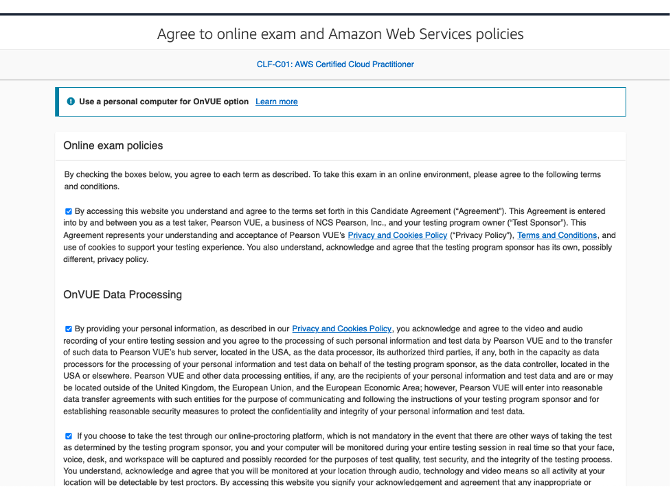

+++ 
title = "Agendar examen" 
chapter = true 
weight = 30 
+++

**Como agendar un examen de certificación de Amazon Web Services**

1. Ir a https://www.aws.training/

1. Seleccionar en el menú superior Certification y luego dar click en go to your account (Sino tiene una cuenta debes crearla asegurar del mantener el mismo Candidate ID)

    

1. Ir al examen que desea presentar en el ejemplo se mostrará como seleccionar AWS Certified Cloud Practitioner. Se encuentran 2 opciones de proveedores o centros de testing para presentar el examen, puede ser físico en un centro de evaluación o virtual (examen supervisado en linea)

    - Físico: debes seleccionar un centro lo más cercano que te convenga

    - Remoto: tienes con contar un computer, buena conexión a internet, una camara y el espacio donde vaya a tomar el examen debe estar depejado. 

    El ejemplo a mostrar es utilizando PearsonVue (pero puedes seleccionar PSI) verificar ambos centros para ver temas de costos del examen y adaptaciones.

    

    Una vez seleccionado PearsonVue se va a direccionar a su portal para agendar el examen.

1. Seleccionar la opción de como quieres presenter el examen ( en el ejemplo, se tomará el examen vía remota en caso u oficina con un PROCTOR (persona que vigila el examen)

    

    

1. Seleccionar el lenguaje del examen (English o Español)

    

1. Aceptar las condiciones. Check todas las Casillas y seleccionar NEXT al final de las condiciones

    

1. Seleccionar el lenguaje del PROCTOR (persona que te vigilará durante el examen)

    

1. Confirmar la zona horaria (en este ejemplo será México)

    

1. Elegir el día que se deseas presentar y a continuación se habilitarán las horas disponibles para ese día

    

1. Una vez seleccionada la hora y dar **Next** se presentará el resumen del costo del examen para generar el pago. En caso de contar con voucher en la siguiente etapa se habilitará la opción para agregar el Código para su canje

    Los vouchers puede ser específicos por proveedor

    

